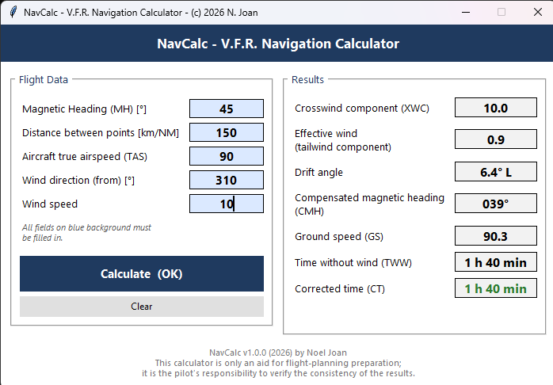

# NavCalc

**V.F.R. Navigation Preparation Calculator** — a Python/Tkinter creation.

Calnav solves the wind triangle used in VFR flight planning: enter your magnetic route, distance, true airspeed and wind, and it computes drift, compensated heading, ground speed and flight times.


---
## 🛫 Screenshot



## ✈️ Features

* Classic wind-triangle calculation (no external dependencies, pure `math` + `tkinter`)
* Crosswind and effective wind (head/tailwind) components, with a label that switches automatically between *headwind* and *tailwind*
* Drift angle with Left/Right indication
* Compensated magnetic heading
* Ground speed, time without wind, and corrected time
* Input validation, including the original rule that route and wind direction must be multiples of 10°
* Clear error messages (e.g. when headwind exceeds true airspeed)

## 📦 Requirements

* Python 3.8 or newer
* `tkinter` (included by default on Windows and macOS installers; on Linux install via your package manager, e.g. `sudo apt install python3-tk`)

No `pip install` needed — the script only uses the Python standard library.

## ▶️ Running the app

```bash
python NavCalc.py
```

On Windows, double-clicking `NavCalc.py` also works if `.py` files are associated with Python.

## 🖥️ Building a standalone .exe (Windows)

You can turn `NavCalc.py` into a single portable `.exe` so it runs without a Python installation, using [PyInstaller](https://pyinstaller.org/).

### 1\. Install PyInstaller

```bash
pip install pyinstaller
```

### 2\. Build the executable

From the folder containing `NavCalc.py`:

```bash
pyinstaller --onefile --windowed --name NavCalc NavCalc.py
```

|Flag|Purpose|
|-|-|
|`--onefile`|bundles everything into a single `NavCalc.exe`|
|`--windowed`|suppresses the console window (GUI app, no terminal needed)|
|`--name NavCalc`|sets the output filename|

### 3\. Find your executable

PyInstaller creates a few folders. Your app is here:

```
dist/NavCalc.exe
```

The `build/` folder and the `NavCalc.spec` file are intermediate artifacts — safe to delete after a successful build, or keep the `.spec` file if you want to fine-tune the build later.

### Optional: custom icon

If you have an `.ico` file (e.g. a recreated version of the original app icon):

```bash
pyinstaller --onefile --windowed --name NavCalc --icon=NavCalc.ico NavCalc.py
```

### Optional: reduce false-positive antivirus warnings

`--onefile` builds are sometimes flagged by antivirus software because they self-extract at runtime. If that's an issue for distribution, use `--onedir` instead (creates a folder with the `.exe` plus its dependencies, extracted ahead of time — starts faster and triggers fewer AV false positives):

```bash
pyinstaller --onedir --windowed --name NavCalc NavCalc.py
```

## 🧮 Calculation reference

Given:

* **MH** — Magnetic Heading (°)
* **Dist** — distance between points
* **TAS** — aircraft true airspeed
* **Wd** — wind direction (where it's coming *from*, °)
* **Ws** — wind speed

The app computes:

```
α (wind angle)   = Wd − MH, normalized to (−180°, 180°]
Cw (crosswind)   = Ws · sin(α)
Ve (eff. wind)   = Ws · cos(α)       →  positive = headwind, negative = tailwind
drift            = asin(Cw / TAS)
heading (CMH)     = MH + drift
GS (ground speed)= TAS · cos(drift) − EW
TSV (no-wind time)   = Dist / TAS · 60 min
TC (corrected time)  = Dist / GS · 60 min
```

## ⚠️ Disclaimer

This calculator is only an aid for flight-planning preparation. It is the pilot's responsibility to verify the consistency of all results before using them in flight. Always cross-check against your official flight planning documentation and current NOTAMs/weather.

## 📄 License

Freeware
Dieses Projekt ist unter der MIT-Lizenz lizenziert. Siehe die [LICENSE](LICENSE)-Datei für Details.

<div align="center">
Made with 🐍  &nbsp;+&nbsp; ✈️  <BR>
(c) Copyright 2026 - Noel Joan    
</div>
